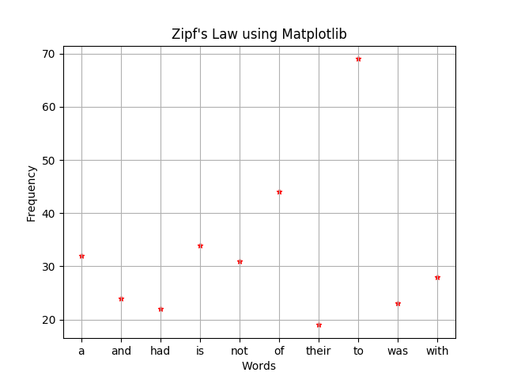

# Zipf's Law in Natural Language

Data Visualization using Python and Matplotlib



### Trying it out

This project requires [pip](https://pip.pypa.io/en/stable/installing/) to run.

Clone the project and Install the Python requirements using pip.

```sh
$ git clone https://github.com/abhishtagatya/zipflaw
$ cd zipfLaw
$ pip install -r requirements.txt
```

Project directory

```sh
.
├── data
│   └── wordcount.json
├── docs
│   └── img
│       └── zipf_py.png
├── essay.txt
├── LICENSE
├── README.md
├── requirements.txt
├── src
│   ├── __init__.py
│   ├── visual.py
└── zipf
```

Before running 'zipf', please add in some text in 'essay.txt' otherwise it will throw and error.
Make sure to check out the 'wordcount.json' for the full visualization of the word frequencies.

The project is in 'src/visual.py' go tweak it to your liking.

### About

The project was solely to learn about Zipf's Law on the frequency distribution of words.
It was hypothesized that words such as (e.g., "the", "of", "and", "to", "a") are considered high-frequency words and words such as (e.g., “accordion,” “catamaran,” “ravioli”) are considered low-frequency words (in english of course).

So I've decided to test out my programming skills to check whether this was true or not. You can definitely do this by yourself and add modifications to it if you see fit.

Although it works, it still lacks accuracy and good data visualization because for some reason Matplotlib messed up my arrangements and that is why you might see that it is not ordered correctly when displayed.

Note that when doing this, make sure you put in enough text in 'essay.txt' or any text file you want to feed it. It seems that the data is most accurate when given more text. So the longer the text the more accurate results you'll get.

### Built With

- [Python 2/3](python.org) - Python Software Foundation
- [Matplotlib](matplotlib.org) - Data Visualization Library

### Author

- ** Abhishta Gatya ** - Computer Science Student

### Reference

- [NCBI Zipf's Law](https://www.ncbi.nlm.nih.gov/pmc/articles/PMC4176592/)
- [WordCount.org](http://www.wordcount.org/main.php)
- [Word Frequency PDF](https://www.wordfrequency.info/files/entries.pdf)
- [Vsauce Video](https://youtu.be/fCn8zs912OE)
